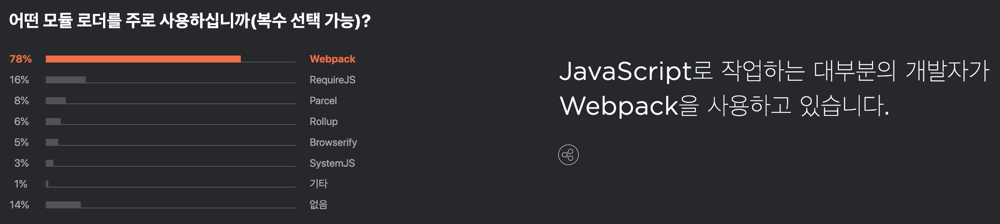
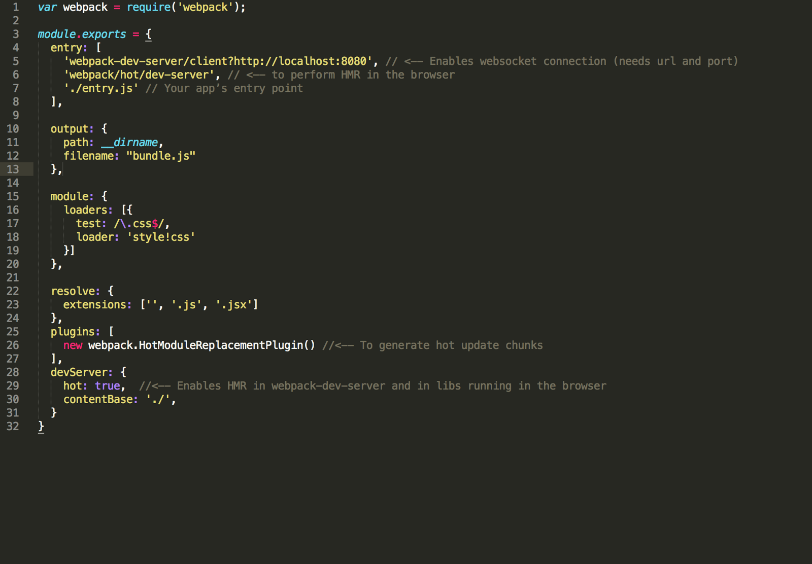

# Webpack 

---

# Webpack 등장 배경
 - 서버에서 처리하는 로직을 자바스크립트에서 구현하는 부분이 많아지고, 자바스크립트 양도 많아졌다. 
 - 코드의 양이 많아질 수록 코드의 유지보수를 위해 모듈화에 대한 요구가 증가!

---

# Webpack이란?
 - Moduler
 	+ [Modules](https://babeljs.io/docs/en/learn/) (ES2015)
 	+ Bundling
    + Compile (eg. sass-loader, css-loader...)
    + Transpile (eg. polyfill...)
 - Development
    + Dev Server 
    
---

# Webpack을 왜 사용해야 할까?

> JETBRAINS 2019년도 개발자 에코시스템의 현황 참고

---

# webpack.config.js
 

---

# 실습 준비
```
npm init

(생략)

npm install webpack --save-dev
npm install webpack-cli --save-dev

(생략)

touch webpack.config.js

```

---

# 실습 1. Module, Bundle

---

# 실습 2. Loader, Plugin
 - Compile 
  	+ loader : sass-loader
  	+ plugin : html-webpack-transpile
 - Transpile 
    + loader : Babel

---

# 실습 3. 
 - Deveolpment 
 	+ DevServer 


